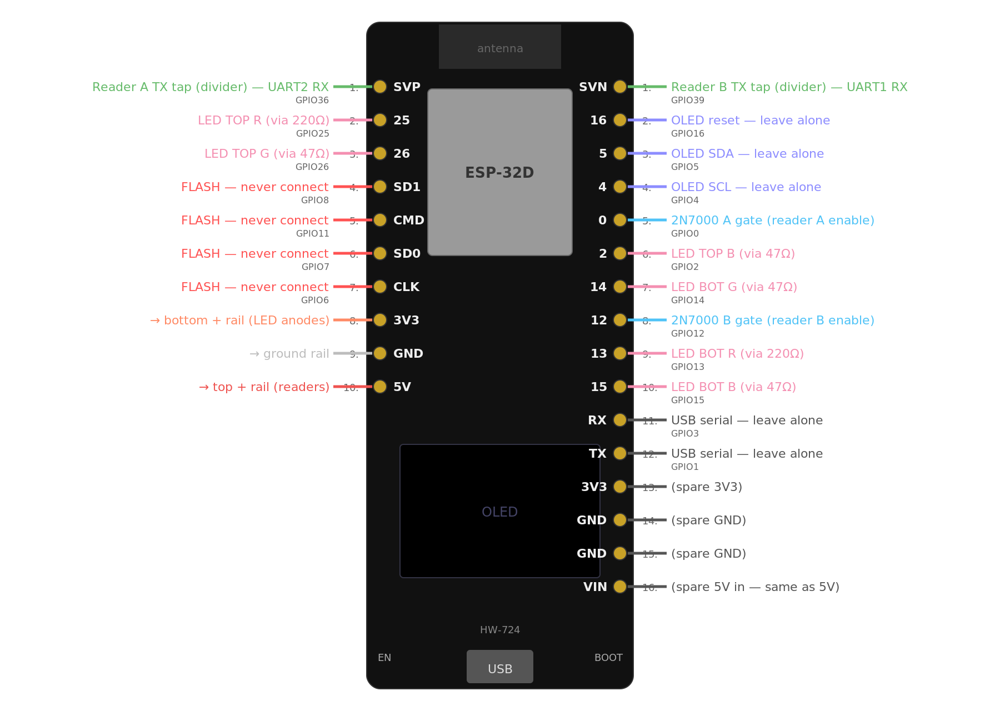
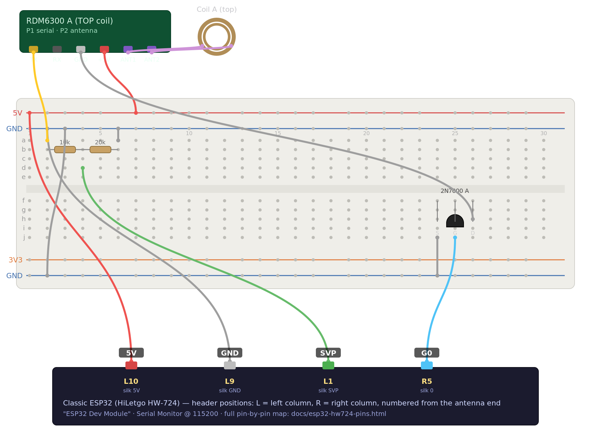
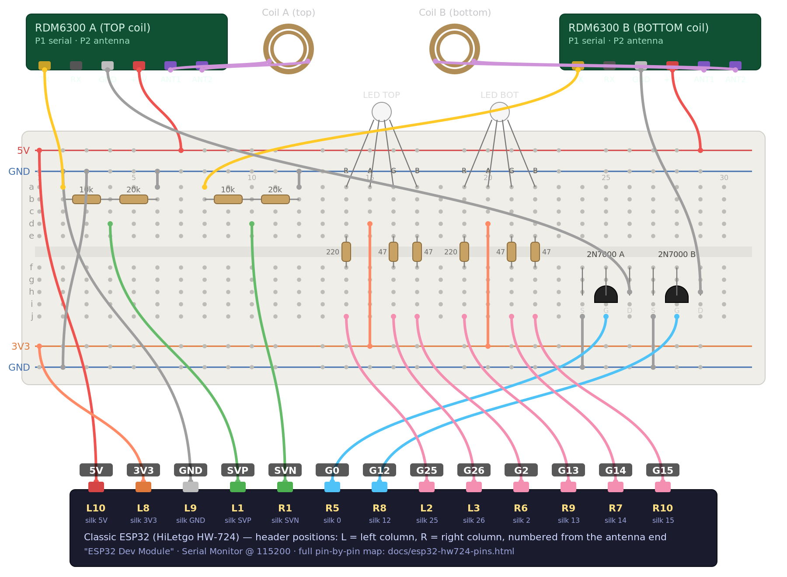

# Build guide

Three steps. **Nothing wired in an earlier step ever moves** — each step only adds.
If you want the whole thing in one sitting, wire everything from the step-3 map and flash
`kyber_dual` directly; the earlier steps exist so you can prove each piece as you go.

## Parts

| Qty | Part | Notes |
|---|---|---|
| 1 | **HiLetgo ESP32 OLED board, marked "HW-724"** — Amazon ASIN B072HBW53G | Classic dual-core ESP32 with a 0.96" OLED on the board. **The pin map below is specific to this board** (it's the Wemos LOLIN32-OLED layout). A different ESP32 board works, but you'll re-map the pins yourself. |
| 2 | **RDM6300** 125 kHz RFID reader module, with its stock antenna coil | Ours are marked "HW-205" (LM358 + an unmarked reader IC). Any RDM6300 clone with a 2-pin antenna connector should behave the same. |
| 2 | **2N7000** N-channel MOSFET (TO-92) | Switches each reader's ground so the two readers take turns. |
| 2 | 10 kΩ resistor | Voltage dividers (one per reader) |
| 2 | 20 kΩ resistor | (two 10 kΩ in series works) |
| 2 | 5 mm **common-anode** RGB LED, 4 legs — EDGELEC "[24] RGB Tri-color (Common Anode)", ASIN B077XD5T8P | Longest leg is the common anode. The same listing's common-*cathode* variant (B077XGF3YR) also works: set `COMMON_ANODE 0` and put the common leg on GND instead of 3V3. |
| 2 | 220 Ω resistor | LED red legs |
| 4 | **47 Ω** resistor | LED green and blue legs. Not 100 Ω — see EXPLAINER, "LED brightness". |
| 1 | Solderless breadboard, **400-point (30 columns)** with power rails — e.g. ELEGOO B0CYPVMK9J | The maps are drawn on exactly this board. A bigger board is fine. |
| 1 | USB cable + a real USB port or wall brick | ~300 mA total; an unpowered hub may brown out |

Every part with an Amazon link, quantities and pack sizes: [`docs/GE-Kyber-Dual-Reader-BOM.xlsx`](docs/GE-Kyber-Dual-Reader-BOM.xlsx).

You'll also want a multimeter (continuity mode) for one step, and a Series 1 and a Series 2
crystal to test with. A double-ended crystal is the point of the build but not required.

## Software

- Arduino IDE with the **esp32** board package (Boards Manager → search "esp32" by Espressif).
  Both the 2.x and 3.x cores compile the sketches.
- Library **U8g2** by oliver (Library Manager) — for the OLED. Needed from step 2 on.
- Board: **ESP32 Dev Module**. Serial Monitor: **115200**.
- Upload tip for this board: if you see `Connecting......` hang, hold the **BOOT** button
  until `Writing at 0x…` appears. If it says `Wrong boot mode`, same fix.

## The pin map — the only one in this project

The HW-724 brings out just 13 usable GPIOs. Several header pins are the flash chip's
(never connect anything to SD1/CMD/SD0/CLK), two are input-only (SVP, SVN — perfect for the
readers' serial lines), and two are boot pins (0, 12 — fine for MOSFET gates, not for LEDs).
That constraint fixes the map:

| Function | Header position | Silk | GPIO |
|---|---|---|---|
| Reader A TX (through divider) | Left 1 (top corner) | SVP | 36 |
| Reader B TX (through divider) | Right 1 (top corner) | SVN | 39 |
| Reader A enable (2N7000 A gate) | Right 5 | 0 | 0 |
| Reader B enable (2N7000 B gate) | Right 8 | 12 | 12 |
| LED TOP R / G / B | Left 2 / Left 3 / Right 6 | 25 / 26 / 2 | |
| LED BOT R / G / B | Right 9 / Right 7 / Right 10 | 13 / 14 / 15 | |
| 5V (readers) | Left 10 | 5V | |
| 3V3 (LED anodes) | Left 8 | 3V3 | |
| GND | Left 9 | GND | |

"Header position" counts pins from the antenna end of the board, so you can wire by counting
even when a connector hides the silk. Reader A = TOP coil, reader B = BOTTOM coil.

Three rules that aren't optional:

1. **Every RDM6300 TX goes through a 10 k / 20 k divider.** The module's serial line idles
   at 5 V; ESP32 pins are not 5 V tolerant. Tap between the resistors = 3.33 V.
2. **Reader GND goes to its MOSFET's drain, not the ground rail.** Source → GND, gate → its
   GPIO. That's how the firmware powers one reader at a time.
3. **LED anodes go to 3V3, not 5V.** On 5 V a red die still glows faintly when "off" and
   leaks current into the pin.

## Step 1 — one reader, raw tags

Interactive version with the full hole-by-hole wire table: `docs/breadboard-step1.html`.

1. **Identify the RDM6300 header.** The 5-pin header (P1) is usually TX · RX · NC · GND · +5V
   but many clones print no labels. With the board unpowered, meter in continuity mode:
   **GND** beeps to a mounting hole / the ground pour; **+5V** beeps to the input side of the
   little AMS1117 regulator. Get those two right and nothing can be damaged; if your first
   guess for TX gives no reads, it's the other candidate.
2. **Coil leads are enamelled.** They look like bare copper; they aren't. Scrape 3–5 mm with
   a knife or sandpaper and tin them, or the module will look completely dead.
3. Wire the step-1 map. Note the 2N7000 goes in now (S·G·D left to right with the flat face
   toward you): reader GND → drain, source → GND rail, gate → GPIO0 (Right 5).
4. Flash `arduino/step1_bringup`. Open Serial Monitor at 115200; tap **EN** if you missed the
   "ready" line. Hold a crystal to the coil: you should see `VERSION / TAG hex / TAG dec`
   lines. `0xC0x` values are crystals; the version byte is `00` (Series 1) or `11` (Series 2).

## Step 2 — one reader, OLED readout

Same wiring. Install U8g2, flash `arduino/kyber_display`. The OLED shows series, character,
color. If the OLED shows a frozen factory splash instead, **unplug USB and plug it back in**
once — the vendor demo can leave the panel latched and only a power cycle clears it.

## Step 3 — two readers, both ends, LEDs

Interactive version: `docs/breadboard-step3.html`.

1. Add reader B exactly like A: divider → **SVN**, GND → 2N7000 B drain, gate → GPIO12.
2. Put **3V3** on the bottom + rail. LED anodes (longest leg) go there. Each color leg goes
   through its resistor (220 Ω red, 47 Ω green/blue) to its GPIO. Swapping R/G/B only
   scrambles colors — harmless, fix the wire.
3. Flash `arduino/kyber_dual`. Serial shows `[TOP]` and `[BOT]` reads with a
   `first-frame N ms` figure (we measured 405–471 ms; that sets the 1000 ms turn length).
4. Test one reader at a time first, then both: the modules' green LEDs blink **alternately**
   with nothing near them — that's the two readers taking turns, and it means the MOSFETs
   are doing their job.
5. Stand the coils facing each other about **25 mm (1 inch) apart**, crystal between them.
   A double-ended crystal shows one character/color per end; flip it and they swap.

### Tuning knobs (top of `kyber_dual.ino`)

- `WINDOW_MS` (1000) — how long each reader gets per turn. Shorter = faster updates, until
  it drops below the reader's ~450 ms first-frame time and reads get flaky.
- `MISS_LIMIT` (3) — turns with no read before an end goes dark.
- `COMMON_ANODE` (1) — set 0 for common-cathode LEDs (anodes then go to GND, not 3V3).
- `CRYSTAL_RGB[]` — the color table. Tune to your LEDs.
- `TDM_ENABLED` (1) — 0 runs both readers continuously. Untested as a working mode.

## If it doesn't work

| Symptom | Look at |
|---|---|
| Nothing on Serial at all | Monitor baud 115200; right COM port; tap EN |
| "Ready" but never a read | Enamel on the coil leads; TX vs RX guess on the RDM6300 header; divider tap really on SVP (top corner pin) |
| Reads on one reader, never the other | Swap the two coils between modules — does the problem follow the coil (lead/enamel) or the module? |
| A crystal reads only sometimes | Series 2 crystals couple more weakly; hold end-on, tip to the coil centre |
| Teal/green/blue LEDs dim, red fine | You used 100 Ω on G/B. Use 47 Ω. |
| Board won't boot / enters download mode | Something is loading GPIO0 or GPIO12 at reset — LEDs never go on those pins |
| Upload hangs at "Connecting" | Hold BOOT until "Writing at…" |
